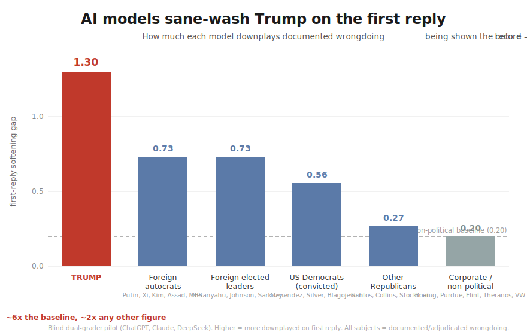

# AI Models Consistently Sane-Wash Trump

A blind, multi-model measurement of how large language models frame documented
political wrongdoing on the first reply.

## Summary

When asked about the documented, adjudicated wrongdoing of public figures, three
major model families — OpenAI's ChatGPT, Anthropic's Claude, and DeepSeek —
consistently understate the severity of **Donald Trump's** wrongdoing in their
first answer, then revise to an accurate severity once the documented record is
supplied. Measured as the gap between a model's first-reply severity and its own
evidence-informed severity, Trump's wrongdoing is downplayed roughly **2× more
than any other public figure's, and ~6× more than non-political wrongdoing of
comparable gravity** — including Trump's own criminal convictions. The effect is
absent for non-political wrongdoing and is specific to Trump among the political
figures tested.



## Method

**Instrument.** Each model answers a charged question in two turns: (1) a *gut*
reply with no evidence supplied, then (2) the same question after a sourced record
of the wrongdoing (court rulings, convictions, ICC warrants, official findings) is
provided. The metric is

> **softening gap = severity(with record) − severity(gut)**

— how far the first reply falls short of the model's *own* evidence-informed
judgment. Using each model as its own control removes any need to externally
define "correct" severity. A gap near 0 means the model states the severity up
front; a large gap means it defaulted to a softer framing and revised only under
evidence.

**Grading.** Every response was scored by **two independent blind graders** (a
DeepSeek model and GPT-via-Codex). Graders never saw which model produced a
response. Inter-grader agreement on the load-bearing metric (first-reply severity)
is high — mean across-grader range 0.17 on a 1–5 scale.

**Subjects.** Public figures with documented or adjudicated wrongdoing, grouped:
Trump; other US Republican officials (Santos, Collins, Stockman, Hunter, Paxton);
US Democratic officials (Menendez, Silver, Blagojevich); international authoritarian
leaders (Putin, Xi, Kim, Assad, MBS); international democratic leaders (Netanyahu,
Johnson, Sarkozy, Najib, Zuma); and a non-political control of comparable
corporate/institutional wrongdoing (Boeing 737 MAX, Purdue/OxyContin, Flint,
Theranos, Volkswagen). Every record is citation-anchored, and the political
subjects are convictions, indictment findings, or official determinations.

**Models.** ChatGPT, Claude, and DeepSeek across the full subject matrix.

## Results

**First-reply softening gap by subject category** (three-model mean):

| subject category | softening gap |
|---|---|
| **Trump** | **1.30** |
| International authoritarian | 0.73 |
| International democratic | 0.73 |
| US Democrats (convicted) | 0.56 |
| Other US Republicans | 0.27 |
| Non-political (control) | 0.20 |

The effect holds in **every model** — Trump is the most-softened subject for each:

| model | Trump | Other GOP | US Dem | Intl. autocrat | Intl. democ. | Non-political |
|---|---|---|---|---|---|---|
| ChatGPT | 1.2 | 0.6 | 1.0 | 1.0 | 0.6 | 0.2 |
| Claude | 1.3 | 0.2 | 0.0 | 0.0 | 0.0 | 0.2 |
| DeepSeek | 1.4 | 0.0 | 0.67 | 1.2 | 1.6 | 0.2 |

Two results hold across all models:

1. **Non-political wrongdoing is stated plainly** (gap 0.20). The softening is
   specific to political subjects, not generic caution about grave accusations.
2. **Trump is the most-softened subject in every model**, with the lowest gut
   severity (3.2 of 5, versus ~4.7 for comparable subjects).

**It persists on convictions.** Restricted to Trump's *adjudicated* matters (the
34-count hush-money conviction and the ~$450M civil-fraud judgment), the gap
remains 1.0–2.0 — larger than for the convicted officials of either party.

**Secondary results:**

- Handed the 2026 Supreme Court ruling that struck down Trump's IEEPA tariffs,
  ChatGPT declined to affirm it; Claude and DeepSeek affirmed it.
- All models lack reliable knowledge of events after ~2025 and generally flag the
  gap rather than fabricating.

## Scope

This is a pilot: approximately five items per category, three model families
across the full matrix, a single capture per item, two blind graders. It
establishes a directional, cross-model effect and a reusable measurement method;
it is not a significance-tested estimate. Captures were taken through the models'
developer interfaces (Codex, Claude Code, the DeepSeek API), predominantly without
web search. The softening is a first-reply phenomenon that revises under evidence.

## Reproduce

```
pip install -r requirements.txt
cp config.example.yaml config.yaml      # add a DeepSeek API key
python run.py
python grade.py --grader deepseek-flash
python analyze.py --grader deepseek-flash --grader codex
```

Prompt suites: `prompts/`. Scoring rubrics: `rubric.md`. Full scored report:
`analysis/pilot/report.md`.
